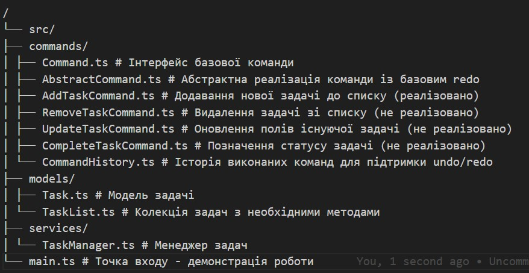
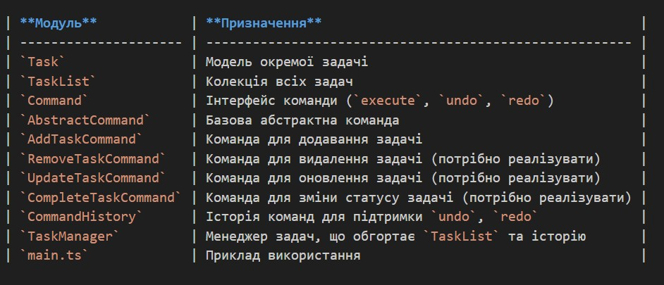
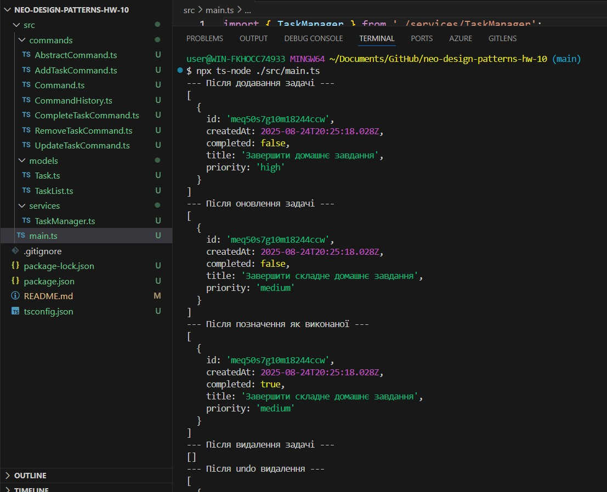
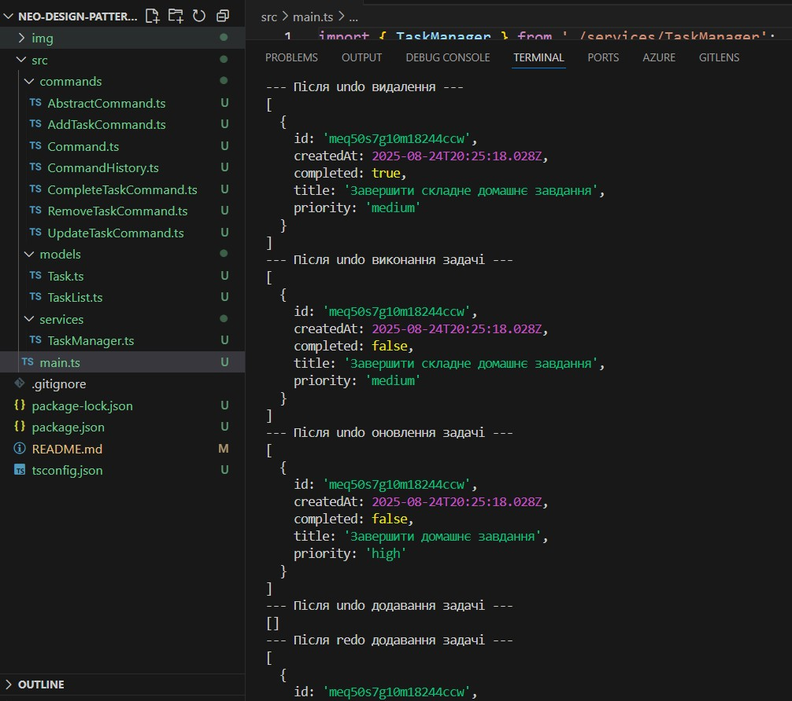
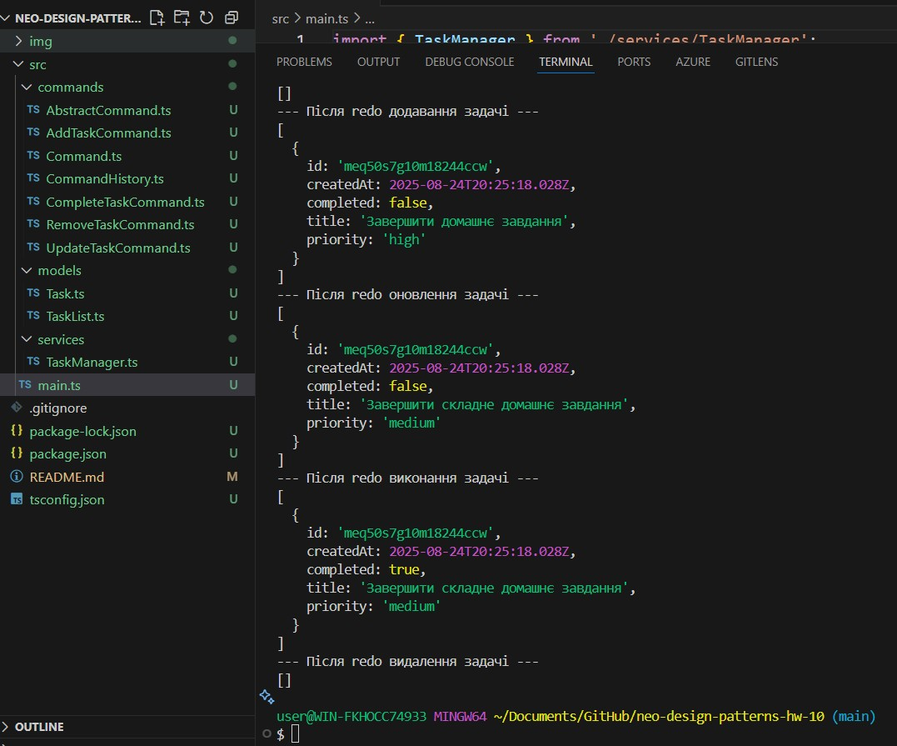

# Домашнє завдання до Теми Поведінковий патерн Команда

# Реалізація TODO-застосунку з використанням патерну Команда

## Опис завдання

У цьому домашньому завданні вам необхідно реалізувати простий, але функціональний TODO-застосунок з використанням патерну **Команда**.

Мета — закріпити розуміння патерну через розробку простого керованого TODO-застосунку із підтримкою додавання, видалення, оновлення задач і керування історією `undo/redo`.

Потрібно реалізувати консольний TODO-застосунок, де кожна дія над задачами оформлена у вигляді об'єкта-команди, де:

- Кожна дія над задачами (додавання, редагування, видалення, позначення виконання) — це окрема команда.
- Всі команди виконуються через єдиний диспетчер `CommandHistory`.
- Можна скасувати `undo` або повторити `redo` останні дії.

## Завдання

Структура проєкту

Проєкт має наступні модулі:

## Очікуваний результат

Після запуску демонстраційного файлу `main.ts` командою:

npx ts-node ./src/main.ts

система повинна послідовно виконати такі дії:

--- Після додавання задачі ---
[
{
id: 'malq1890pizz2ibuob',
createdAt: 2025-05-12T23:35:50.532Z,
completed: false,
title: 'Завершити домашнє завдання',
priority: 'high'
}
]
--- Після оновлення задачі ---
[
{
id: 'malq1890pizz2ibuob',
createdAt: 2025-05-12T23:35:50.532Z,
completed: false,
title: 'Завершити складне домашнє завдання',
priority: 'medium'
}
]
--- Після позначення як виконаної ---
[
{
id: 'malq1890pizz2ibuob',
createdAt: 2025-05-12T23:35:50.532Z,
completed: true,
title: 'Завершити складне домашнє завдання',
priority: 'medium'
}
]
--- Після видалення задачі ---
[]
--- Після undo видалення ---
[
{
id: 'malq1890pizz2ibuob',
createdAt: 2025-05-12T23:35:50.532Z,
completed: true,
title: 'Завершити складне домашнє завдання',
priority: 'medium'
}
]
--- Після undo виконання задачі ---
[
{
id: 'malq1890pizz2ibuob',
createdAt: 2025-05-12T23:35:50.532Z,
completed: false,
title: 'Завершити складне домашнє завдання',
priority: 'medium'
}
]
--- Після undo оновлення задачі ---
[
{
id: 'malq1890pizz2ibuob',
createdAt: 2025-05-12T23:35:50.532Z,
completed: false,
title: 'Завершити домашнє завдання',
priority: 'high'
}
]
--- Після undo додавання задачі ---
[]
--- Після redo додавання задачі ---
[
{
id: 'malq1890pizz2ibuob',
createdAt: 2025-05-12T23:35:50.532Z,
completed: false,
title: 'Завершити домашнє завдання',
priority: 'high'
}
]
--- Після redo оновлення задачі ---
[
{
id: 'malq1890pizz2ibuob',
createdAt: 2025-05-12T23:35:50.532Z,
completed: false,
title: 'Завершити складне домашнє завдання',
priority: 'medium'
}
]
--- Після redo виконання задачі ---
[
{
id: 'malq1890pizz2ibuob',
createdAt: 2025-05-12T23:35:50.532Z,
completed: true,
title: 'Завершити складне домашнє завдання',
priority: 'medium'
}
]
--- Після redo видалення задачі ---
[]

## Результат

